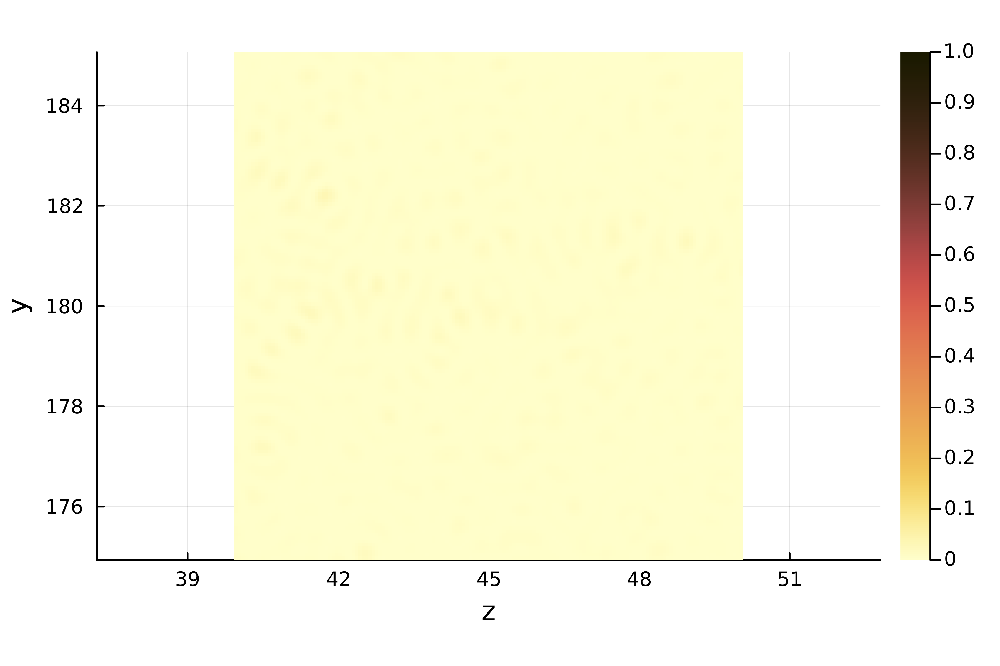

# Focusing Phase Conjugated Light Through Disorder

In this example, we show how to use mesti() to compute the field profile of a point source in a scattering disordered medium, do phase conjugation to determine an incident wavefront that can focus on the the disorder, and then use mesti2s() again to compute the field profile to show its focus.

```julia
# Call necessary packages
using MESTI, Arpack, Plots

# Include the function to build epsilon_xx for the disordered
include("build_epsilon_disorder_wo_subpixel_smoothing.jl")
```

# System parameters

```julia
# dimensions of the system, in units of the wavelength lambda_0
dx      = 1/15  # discretization grid size
W       = 360   # width of the scattering region
L       = 90    # thickness of the scattering region
L_tot   = 120   # full length of the system for plotting
r_min   = 0.2   # minimal radius of the cylindrical scatterers
r_max   = 0.4   # maximal radius of the cylindrical scatterers
min_sep = 0.05  # minimal separation between cylinders
number_density = 1.3  # number density, in units of 1/lambda_0^2
rng_seed = 0   # random number generator seed

# relative permittivity, unitless
epsilon_scat = 1.2^2  # cylindrical scatterers
epsilon_bg   = 1.0^2  # background in the scattering region
epsilon_low  = 1.0^2  # frees space on the low side
epsilon_high = 1.0^2  # frees space on the high side

yBC = "periodic" # boundary condition in y

# generate a random collection of non-overlapping cylinders
# note: subpixel smoothing is not applied for simplicity
build_TM = true
no_scatterered_center = true
(epsilon, y0_list, z0_list, r0_list, y_Ex, z_Ex) =
build_epsilon_disorder_wo_subpixel_smoothing(W, L, r_min, r_max, min_sep,  
                                             number_density, rng_seed, dx,
                                             epsilon_scat, epsilon_bg, build_TM; 
                                             no_scatterer_center = true)
```

# Compute the field profile of a point source 

```julia
syst = Syst()
pml_npixels = 10
syst.length_unit  = "lambda_0"
syst.wavelength = 1
syst.dx = dx
syst.yBC = yBC
# specify the permittivity profile of the simulation domain including the low side, scattering region and the high side.
syst.epsilon_xx = cat(epsilon_low*ones(size(epsilon,1),pml_npixels+1), epsilon, epsilon_high*ones(size(epsilon,1),pml_npixels+1), dims=2)

# specify the input (point source in the middle of the disordered)
m0_focus = Int((W/dx)/2)
l0 = Int((L/dx)/2)
Bx = Source_struct()
Bx.pos = [[m0_focus,l0+pml_npixels+1,1,1]]
Bx.data = [ones(1,1)]

# put PML along z-direction
pml = get_optimal_PML(syst.wavelength/syst.dx)
pml.npixels = pml_npixels
pml.direction = "z"
syst.PML = [pml]

# field profile: input from a point source
Ex_field, _ = mesti(syst, [Bx])
```
```text:Output
===System size===
ny_Ex = 5400; nz_Ex = 1372 for Ex(y,z)
UPML on -z +z sides; ; yBC = periodic; zBC = PEC
Building B,C... elapsed time:   0.184 secs
Building A  ... elapsed time:   7.882 secs
< Method: factorize_and_solve using MUMPS in single precision with AMD ordering >
Analyzing   ... elapsed time:   3.214 secs
Factorizing ... elapsed time:  58.866 secs
Solving     ... elapsed time:   4.726 secs
          Total elapsed time:  69.569 secs
```

# Compute the regular focusing and phase-conjugated focusing profile

```julia
# Specify the system for mesti2s() and mesti_build_channels()
syst = Syst()
syst.epsilon_xx = epsilon
syst.length_unit  = "lambda_0"
syst.wavelength = 1
syst.dx = dx
syst.yBC = yBC
syst.epsilon_low = epsilon_low
syst.epsilon_high = epsilon_high

# equivalent average epsilon for this disordered system
epsilon_ave = mean(epsilon)

# build channels for the equivalent average epsilon and low side (air)
channels_ave_epsilon = mesti_build_channels(Int(W/dx), yBC, 2*pi*syst.wavelength*dx, epsilon_ave)
channels_low         = mesti_build_channels(Int(W/dx), yBC, 2*pi*syst.wavelength*dx, epsilon_low)
N_prop_ave_epsilon = channels_ave_epsilon.N_prop # number of propagating channels on the equivalent average epsilon 
N_prop_low = channels_low.N_prop                 # number of propagating channels on the low side 

dn = 0.5
# regular focus wavefront
wf_reg_focus = exp.(-1im*channels_ave_epsilon.kydx_prop*(m0)) .* exp.(-1im*channels_ave_epsilon.kzdx_prop*(n0_focus-dn))

# build projection matrix C on the low side
C_low = channels_low.sqrt_nu_prop.*exp.((-1im*dn)*channels_low.kzdx_prop).*convert(Matrix, adjoint(channels_low.u_x_m(channels_low.kydx_prop)))
proj_coefficient = conj(C_low*Ex_field[:,pml_npixels+1])

# specify two input incident wavefronts:
# (1) regular focusing wavefront
# (2) phase-conjugated focusing wavefront
input = wavefront()
input.v_low = zeros(ComplexF64, N_prop_low, 2)
input.v_low[:, 1] = wf_reg_focus[Int((N_prop_ave_epsilon-N_prop_low)/2+1):Int(end-(N_prop_ave_epsilon-N_prop_low)/2)]/norm(wf_reg_focus[Int((N_prop_ave_epsilon-N_prop_low)/2+1):Int(end-(N_prop_ave_epsilon-N_prop_low)/2)])

# for the phased conjugated input: 
# conj(coefficient*u) = conj(coefficient)*conj(u) = conj(coefficient)*conj(u) =  conj(coefficient)*perm(u(ky)) = perm(conj(coefficient))*u(ky)
# perm() means permute a vector that switches one propagating channel with one
# having a complex-conjugated transverse profile
# for periodic boundary, this flips the sign of ky. 
input.v_low[:, 2] = conj(proj_coefficient)[channels.low.ind_prop_conj]/norm(proj_coefficient)


# we will also get the field profile in the free spaces on the two sides, for
# plotting purpose.
opts = Opts()
opts.nz_low = round((L_tot-L)/2/dx)
opts.nz_high = opts.nz_low

# for field-profile computations
Ex, _, _ = mesti2s(syst, input, opts)
```
```text:Output
===System size===
ny_Ex = 5400; nz_Ex = 1350 => 1372 for Ex(y,z)
[N_prop_low, N_prop_high] = [725, 725] per polarization
yBC = periodic; zBC = [PML, PML]
Building B,C... elapsed time:   0.957 secs
            ... elapsed time:   1.008 secs
Building A  ... elapsed time:   6.261 secs
< Method: factorize_and_solve using MUMPS in single precision with AMD ordering >
Analyzing   ... elapsed time:   3.065 secs
Factorizing ... elapsed time:  74.095 secs
Solving     ... elapsed time:   4.582 secs
            ... elapsed time:   6.524 secs
          Total elapsed time: 103.675 secs
```

# Animate the field profiles and show the intensity profiles

```julia
# normalize the field amplitude with respect to the phase-conjugated-input profile
Ex = Ex/maximum(abs.(Ex[:,:,2]))

nframes_per_period = 20

# extend the x coordinate to include free spaces on the two sides
z_Ex = vcat(z_Ex[1] .- (opts.nz_low:-1:1)*dx, z_Ex, z_Ex[end] .+ (1:opts.nz_high)*dx)

# animate the field profile with the regular focusing input
anim_regular_focusing = @animate for ii ∈ 0:(nframes_per_period-1)
    plt1 = (heatmap(z_Ex,collect(y_Ex),real.(Ex[:,:,1]*exp(-1im*2*π*ii/nframes_per_period)),
            xlabel = "z", ylabel = "y", c = :balance, clims=(-1, 1), aspect_ratio=:equal, dpi = 600))

    display(plot(plt1))    
end
gif(anim_regular_focusing, "regular_focusing.gif", fps = 10)
```


```julia
# plot the zoom-in intensity profile of the regular focusing input
y_Ex_ind_plot_range = searchsortedfirst(y_Ex, 175)-1:searchsortedfirst(y_Ex, 185)
z_Ex_ind_plot_range = searchsortedfirst(z_Ex, 40)-1:searchsortedfirst(z_Ex, 50)

plt2 = (heatmap(z_Ex[z_Ex_ind_plot_range],y_Ex[y_Ex_ind_plot_range],
                abs.(Ex[y_Ex_ind_plot_range,z_Ex_ind_plot_range,1]).^2,
                xlabel = "z", ylabel = "y", c =cgrad(:lajolla, rev=true), clims=(0, 1), 
                aspect_ratio=:equal, dpi = 600))

display(plot(plt2))
```


```julia
# animate the field profile of the phase-conjugated focusing input
anim_phase_congjuation = @animate for ii ∈ 0:(nframes_per_period-1)
    plt3 = (heatmap(z_Ex,collect(y_Ex),real.(Ex[:,:,2]*exp(-1im*2*π*ii/nframes_per_period)),
            xlabel = "z", ylabel = "y", c = :balance, clims=(-1, 1), aspect_ratio=:equal, dpi = 600))

    display(plot(plt3))    
end
gif(anim_phase_congjuation_focusing, "phase_conjugated_focusing.gif", fps = 10)
```


```julia
# plot the zoom-in intensity profile of the phase-conjugated focusing input
plt4 = (heatmap(z_Ex[z_Ex_ind_plot_range],y_Ex[y_Ex_ind_plot_range],
                abs.(Ex[y_Ex_ind_plot_range,z_Ex_ind_plot_range,2]).^2,
                xlabel = "z", ylabel = "y", c =cgrad(:lajolla, rev=true), clims=(0, 1), 
                aspect_ratio=:equal, dpi = 600))

display(plot(plt4))
```


```julia
# compare the ratio of intensity on the focus point

println(" I_phase_congugation(y_0,z_0)/I_reg(y_0,z_0) = $(abs.(Ex[m0,opts.nz_low+l0,2]).^2/abs.(Ex[m0,opts.nz_low+l0,1]).^2)")
```
```text:Output
I_phase_congugation(y_0,z_0)/I_reg(y_0,z_0) = 77.5095827453711
```